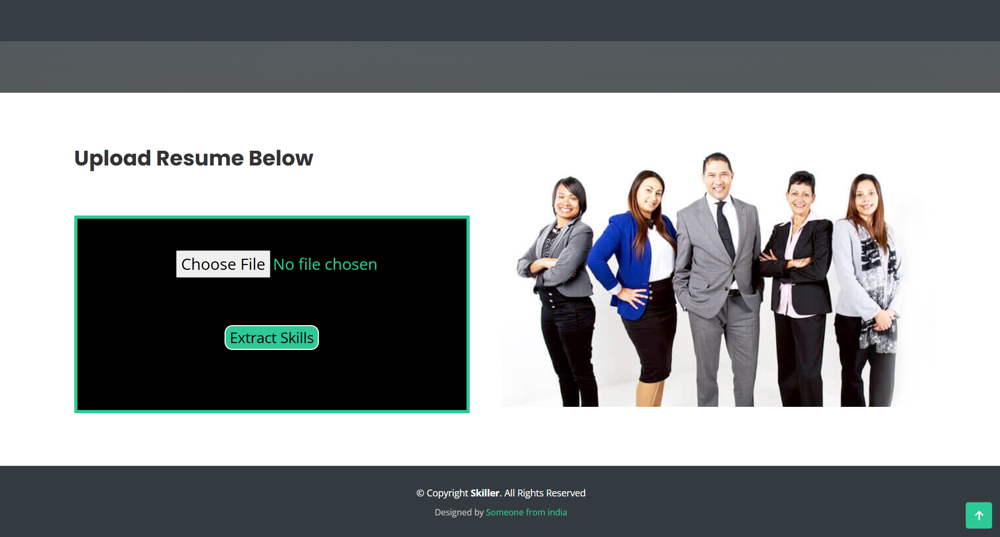
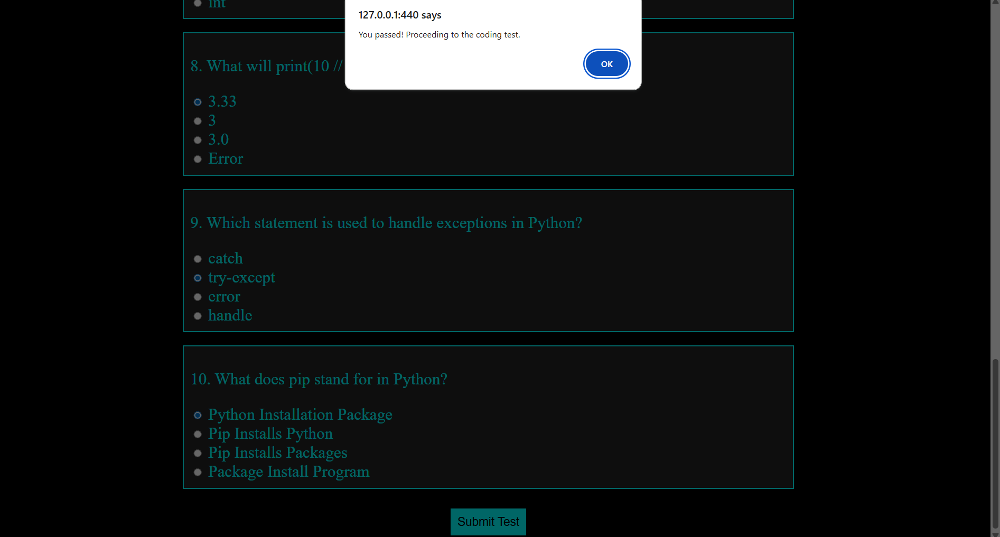
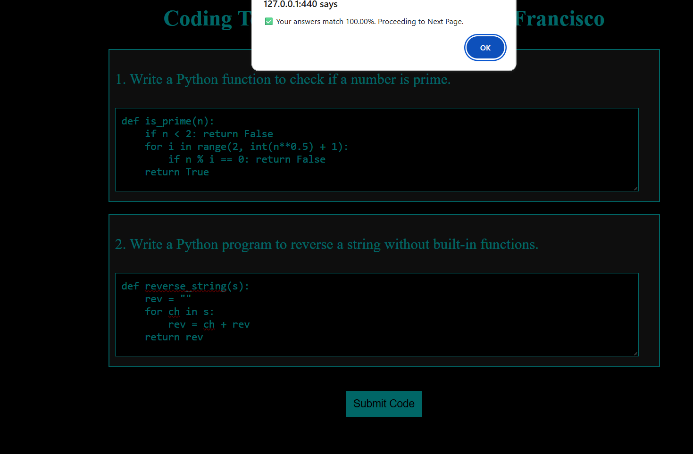
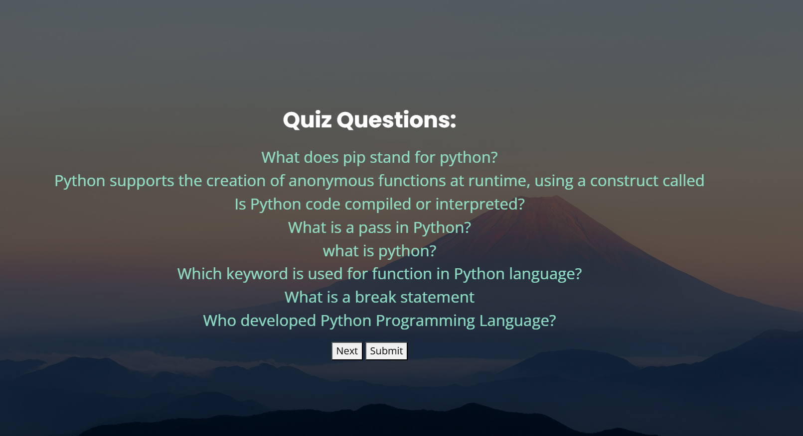
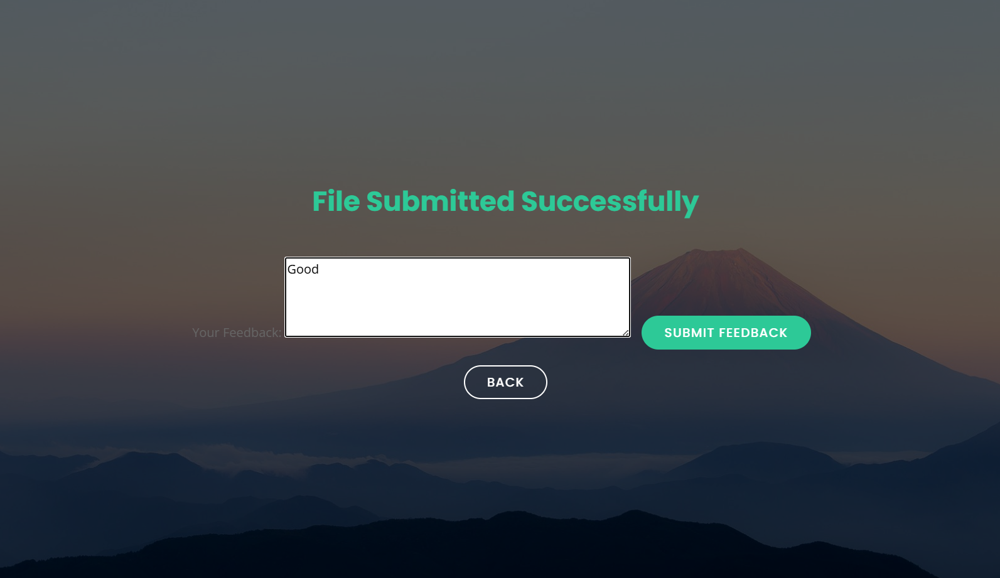

# 🎯 Skill-Based Quiz Project

A **complete Skill-Based Quiz system** with **resume upload, aptitude & coding questions, live camera-based questions, feedback, and marks tracking**.  
This project simulates a real-time assessment platform for candidates.

---

## 🚀 Features

- **Resume Upload:** Candidates can upload resumes to participate.  
- **Aptitude Questions:** Multiple-choice questions to test reasoning and logic.  
- **Coding Questions:** Programming questions with evaluation.  
- **Live Camera Questions:** Real-time facial expression detection to monitor responses.  
- **Feedback:** Personalized performance feedback.  
- **Marks & Analysis:** Automatic scoring and analytics report.

---

## 🖼 Screenshots

### Resume Upload


### Aptitude Questions


### Coding Questions


### Live Camera Questions


### Feedback


### Marks & Analysis


---

## ⚙️ Installation

1. Clone the repository:
```bash
git clone https://github.com/KALAIYARASISANTHOSH/Skill-Based-Question-Generate-and-analysis-facial-expression.git
